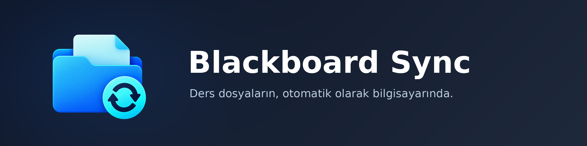

<p align="center"></p>

Yeni ders içeriklerini otomatik indirip Blackboard’daki klasör yapısıyla bilgisayarına kaydeder. Arka planda her saat kontrol eder, yeni bir şey geldiğinde bildirim gösterir.

## Ekran görüntüleri

<!-- Görseller ve video buraya eklenecek -->

## Kurulum

[Son sürümü indir](https://github.com/UmutYLCN/blackboard-sync/releases/latest):

- **macOS:** `.dmg` dosyasını aç, uygulamayı **Applications** klasörüne sürükle. İlk açılışta sağ tık → **Aç**.
- **Windows:** `Setup.exe` dosyasını çalıştır. SmartScreen uyarısı çıkarsa **Ek bilgi → Yine de çalıştır**.

### Terminalden tek komutla

macOS:

```sh
curl -fsSL https://raw.githubusercontent.com/UmutYLCN/blackboard-sync/main/install.sh | sh
```

Windows (PowerShell):

```powershell
irm https://raw.githubusercontent.com/UmutYLCN/blackboard-sync/main/install.ps1 | iex
```

İlk açılışta okul adresini ve kayıt klasörünü seç, ardından **Giriş yap**.

## Gizlilik

Şifreni yalnızca okulunun kendi giriş sayfasına yazarsın; uygulama şifreni görmez ve hiçbir yere kaydetmez. Saatlik senkron için gereken giriş oturumu yalnızca kendi bilgisayarında tutulur ve hiçbir sunucuya gönderilmez.

Lisans: [MIT](LICENSE).

Blackboard Sync bağımsız bir projedir; Anthology Inc. ile bağlantılı değildir ve onların onayını taşımaz. Blackboard, sahibinin ticari markasıdır.
